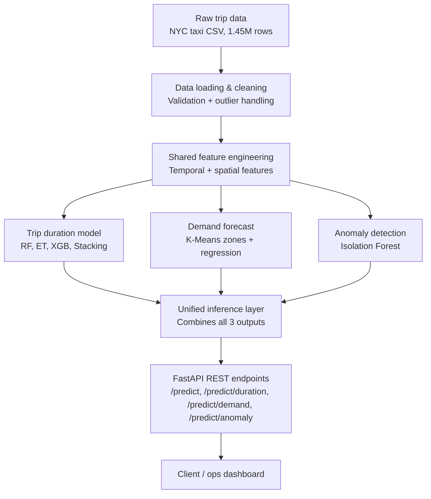

# Ride-Hailing Zonal Demand Forecasting & Trip-Duration Ensemble with Anomaly Flagging

A production-style machine learning system for ride-hailing operations, built around three independent pipelines that share a common data foundation: **trip duration prediction**, **hourly zonal pickup demand forecasting**, and **unsupervised trip anomaly detection**.

This is not a single Kaggle-leaderboard notebook. It's a modular repository — config-driven, independently testable, independently retrainable per pipeline — served behind a REST API, designed the way a ride-hailing platform's ML infrastructure actually needs to be designed: three different questions, for three different consumers, on three different retrain schedules, composed into one coherent service at the inference layer.

---

## Table of Contents

1. [Business Problem](#business-problem)
2. [Solution Architecture](#solution-architecture)
3. [Dataset](#dataset)
4. [Feature Engineering](#feature-engineering)
5. [Pickup Zone Clustering](#pickup-zone-clustering)
6. [Models](#models)
7. [Results](#results)
8. [Project Structure](#project-structure)
9. [Getting Started](#getting-started)
10. [API Usage](#api-usage)
11. [Screenshots & Visualizations](#screenshots--visualizations)
12. [Future Improvements](#future-improvements)
13. [Resume Bullet Points](#resume-bullet-points)
14. [Interview Questions & Answers](#interview-questions--answers)

---

## Business Problem

Ride-hailing platforms need to answer three operationally distinct questions, each with a different consumer and a different failure mode:

| # | Question | Consumer | Cadence |
|---|---|---|---|
| 1 | How long will *this specific trip* take? | ETA display, time-based pricing | Per-trip, real-time |
| 2 | How many pickups will *this zone* see in the next hour? | Driver repositioning / surge logic | Rolling, every 15–60 min |
| 3 | Is *this completed trip's* data trustworthy? | Fraud / data-quality review queue | Post-trip, batch or on-demand |

These are kept as **three separate models**, not one entangled multi-output system, because they genuinely differ in every dimension that matters operationally: duration is a per-trip regression evaluated the instant a ride is requested; demand is a zone-hour time series forecast on a rolling schedule; anomaly detection has no ground-truth labels at all, since nothing in the raw data says "this trip was fake." A retrain of the anomaly detector should never force a redeploy of the duration model, and vice versa — that constraint shaped nearly every architectural decision in this repo.

---

## Solution Architecture



**Design principles this repo follows throughout:**

- **Config-driven, not hardcoded.** Every threshold, hyperparameter, and path lives in `config/config.yaml`. Nothing that might reasonably change lives buried in Python.
- **Shared feature engineering, independent modeling.** Temporal and spatial features are computed once and reused by all three pipelines; each pipeline's model training is otherwise fully decoupled from the others.
- **Training and inference share code, never duplicate it.** The same feature functions, the same distance formulas, the same inverse-transform logic run at training time and at prediction time — eliminating an entire class of "it worked in training but not in production" bugs.
- **Graceful degradation over all-or-nothing failure.** The unified inference layer reports partial results with per-component status rather than letting one pipeline's failure take down the other two.

---

## Dataset

**Source:** [NYC Taxi Trip Duration](https://www.kaggle.com/c/nyc-taxi-trip-duration/data) (2016 NYC TLC Yellow Cab data, Kaggle competition format)

**Raw size:** 1,458,644 trips, 11 columns (`id`, `vendor_id`, `pickup_datetime`, `dropoff_datetime`, `passenger_count`, `pickup_longitude`, `pickup_latitude`, `dropoff_longitude`, `dropoff_latitude`, `store_and_fwd_flag`, `trip_duration`).

**Data quality findings from EDA** (`notebooks/01_eda.py`), which directly drove every cleaning rule in `src/data/clean_data.py`:

| Issue | Count | % of dataset |
|---|---|---|
| Trip duration < 10 seconds | 1,984 | 0.136% |
| Trip duration > 24 hours | 4 | 0.0003% |
| Pickup coordinates outside NYC bounds | 196 | 0.013% |
| Dropoff coordinates outside NYC bounds | 609 | 0.042% |
| Duplicate trip IDs | 0 | — |
| `trip_duration` disagreeing with `dropoff − pickup` | 0 | — |
| Missing values (any column) | ~0% | — |

Notably, out-of-bounds **dropoff** coordinates occur roughly 3x more often than out-of-bounds **pickup** coordinates — plausible given a pickup is dispatched from a real street address while a dropoff GPS fix can drift or fail mid-trip, and a real, evidenced finding rather than an assumed symmetry.

---

## Feature Engineering

### Temporal features (`src/features/temporal_features.py`)

| Feature | Description | Why it matters |
|---|---|---|
| `pickup_hour`, `pickup_weekday` | Raw integer hour (0–23) / weekday (0–6) | Tree models split on these directly |
| `pickup_is_weekend` | Binary flag | Captures a distinct demand regime |
| `pickup_is_rush_hour` | Binary flag, config-driven windows | Captures the two daily demand peaks found in EDA |
| `pickup_hour_sin/cos`, `pickup_weekday_sin/cos` | Cyclic encoding | Prevents a linear model from treating 23:00 and 00:00 as maximally different, when they're one hour apart |

### Spatial features (`src/features/spatial_features.py`)

| Feature | Description | Why it matters |
|---|---|---|
| `trip_distance_km` | Vectorized haversine (great-circle) distance | The dominant real driver of trip duration |
| `manhattan_distance_km` | Sum of pure-latitude and pure-longitude haversine legs | Approximates NYC's grid-based road distance better than straight-line distance |
| `bearing_degrees`, `bearing_sin/cos` | Initial compass bearing, cyclically encoded | Same wrap-around problem as hour-of-day (0° = 360°) |
| `trip_direction` | 8-point compass bucket (N/NE/E/SE/S/SW/W/NW) | Fixed geometry, not a tunable business rule |

**14 engineered features total**, validated end-to-end for `NaN`/`inf` before ever reaching a model.

### Anomaly-specific features (`src/models/anomaly/train_isolation_forest.py`)

| Feature | Formula | Why it matters |
|---|---|---|
| `average_speed_kmh` | `trip_distance_km / (trip_duration / 3600)` | The sharpest physically-implausible-trip detector available |
| `route_efficiency_ratio` | `trip_distance_km / manhattan_distance_km` | A ratio ≥ 1 is mathematically near-impossible for a real route and flags a coordinate/GPS error directly |

### Demand-forecast features (`src/models/demand/build_hourly_dataset.py`)

- **Lag features:** `demand_lag_{1,2,3,24}h` — leakage-free, computed with `.shift()` **before** any rolling operation.
- **Rolling features:** `demand_rolling_mean_{3,6,24}h` — strictly excludes the current hour (`shift(1).rolling(...)`), guarding against the classic mistake of a rolling window leaking the target into its own feature.
- **Calendar features:** hour-of-day, day-of-week, weekend flag, all cyclically encoded via a shared `cyclic_encode()` helper.

---

## Pickup Zone Clustering

**Method:** K-Means, `n_clusters=30`, fit on longitude-corrected coordinates (scaled by `cos(reference_latitude)` to account for meridian convergence at NYC's latitude, so Euclidean distance behaves consistently in both axes).

**Why K-Means over DBSCAN:**

1. Zone count needs to be a **business decision** (a fixed, operable number of zones), not an emergent property of density parameters.
2. NYC's pickup density is extremely uneven (dense Manhattan core vs. sparse outer boroughs) — a single global DBSCAN `eps` cannot resolve both regimes well simultaneously.
3. Every pickup needs an actionable zone assignment — DBSCAN's `-1` "noise" label is not a valid output for a driver-repositioning system.
4. K-Means gives cheap, native `O(1)` zone assignment for new points at inference time; DBSCAN has no native equivalent.

---

## Models

### Pipeline 1 — Trip Duration (regression, random 80/20 split)

| Model | Notes |
|---|---|
| Linear Regression | Baseline — establishes the floor to beat |
| Random Forest | Tests non-linear feature interactions |
| Extra Trees | Same hypothesis, different bias/variance trade-off |
| XGBoost | Tests boosting vs. bagging |
| **Stacking Ensemble** (final model) | RF + ET + XGBoost base estimators, `RidgeCV` meta-learner, leakage-free via `StackingRegressor`'s internal cross-validation |

Target trained as `log1p(trip_duration)`; predictions inverse-transformed via `expm1` and floored at the training minimum before scoring.

### Pipeline 2 — Zonal Demand Forecasting (regression, **chronological** split)

| Model | Notes |
|---|---|
| Linear Regression | Baseline |
| Random Forest | Non-linear zone/time interactions |
| XGBoost | Boosting comparison |

Split chronologically (not randomly) — the lag/rolling features make row *N* dependent on earlier hours, so a random split would leak future information into training. Evaluated with both standard MAPE and a zero-aware `mape_excluding_zero_actuals`, since a meaningful fraction of zone-hours legitimately have zero pickups.

### Pipeline 3 — Trip Anomaly Detection (unsupervised)

**Isolation Forest**, `contamination=0.02`, 5 features (`trip_duration`, `trip_distance_km`, `average_speed_kmh`, `route_efficiency_ratio`, `passenger_count`), no feature scaling required. Chosen over Local Outlier Factor and One-Class SVM for scalability (~O(n log n) vs. LOF's neighbor search or OCSVM's quadratic-to-cubic training cost) and cheap native scoring of new points at inference time.

---

## Results

> **Fill this section in from your own trained artifacts** — the exact numbers depend on your training run. Regenerate everything (including the plots referenced below) with:
> ```bash
> python -m src.evaluation.cross_pipeline_report
> ```
> which reads `models/duration/comparison_table.csv` and `models/demand/comparison_table.csv` directly, so this table can never drift from what was actually trained.

**Trip duration (test set, seconds):**

| Model | MAE | RMSE | MAPE | R² |
|---|---|---|---|---|
| Linear Regression | _—_ | _—_ | _—_ | _—_ |
| Random Forest | _—_ | _—_ | _—_ | _—_ |
| Extra Trees | _—_ | _—_ | _—_ | _—_ |
| XGBoost | _—_ | _—_ | _—_ | _—_ |
| **Stacking Ensemble** | _—_ | _—_ | _—_ | _—_ |

**Zonal demand (test set, pickups/hour):**

| Model | MAE | RMSE | MAPE (non-zero only) | R² |
|---|---|---|---|---|
| Linear Regression | _—_ | _—_ | _—_ | _—_ |
| Random Forest | _—_ | _—_ | _—_ | _—_ |
| XGBoost | _—_ | _—_ | _—_ | _—_ |

**Anomaly detection:** no accuracy metric applies — there is no ground truth. `contamination=0.02` flags ~2% of trips for review; see `reports/top_20_flagged_trips.csv` for the human-reviewable evidence.

---

## Project Structure

```
ride-hailing-ml/
├── README.md
├── requirements.txt
├── .gitignore
├── config/
│   └── config.yaml                # all paths, hyperparameters, thresholds
├── data/
│   ├── raw/                       # train.csv (gitignored, download separately)
│   ├── interim/                   # cleaned, not yet feature-engineered
│   └── processed/                 # model-ready datasets
├── notebooks/
│   └── 01_eda.py                  # Jupytext-paired EDA notebook
├── src/
│   ├── utils/
│   │   └── config_loader.py       # validated, cached config access
│   ├── data/
│   │   ├── load_data.py           # schema-validated raw loading
│   │   └── clean_data.py          # sequential, auditable cleaning rules
│   ├── features/
│   │   ├── temporal_features.py
│   │   ├── spatial_features.py
│   │   └── build_features.py      # shared orchestration, NaN/inf validation
│   ├── zones/
│   │   └── kmeans_zones.py        # PickupZoneClusterer
│   ├── models/
│   │   ├── duration/               # baseline, tree models, stacking
│   │   ├── demand/                 # hourly dataset build, model comparison
│   │   └── anomaly/                # Isolation Forest
│   ├── evaluation/
│   │   ├── metrics.py             # shared regression_metrics/compare_models
│   │   └── cross_pipeline_report.py
│   ├── inference/
│   │   ├── errors.py
│   │   ├── duration_predictor.py
│   │   ├── demand_predictor.py
│   │   ├── anomaly_scorer.py
│   │   └── unified_pipeline.py
│   └── visualization/
│       └── plots.py
├── api/
│   ├── main.py                    # FastAPI app, lifespan model loading
│   ├── schemas.py                 # Pydantic request/response models
│   └── routers/
│       ├── duration.py
│       ├── demand.py
│       └── anomaly.py
├── models/                        # saved .joblib artifacts (gitignored)
├── scripts/
│   ├── train_zones.py             # thin entry point (avoids __main__-pickling bug)
│   └── train_anomaly_detector.py  # thin entry point (avoids __main__-pickling bug)
├── reports/
│   └── figures/                   # saved evaluation plots
└── tests/                         # pytest suite
```

---

## Getting Started

```bash
# 1. Clone and create a Python 3.12+ virtual environment
python3.12 -m venv venv
source venv/bin/activate        # Windows: venv\Scripts\Activate.ps1

# 2. Install dependencies
pip install -r requirements.txt

# 3. Download train.csv from Kaggle and place it at:
#    data/raw/train.csv

# 4. Run the pipeline end to end
python -m src.data.clean_data
python -m src.features.build_features
python scripts/train_zones.py
python -m src.models.demand.build_hourly_dataset
python -m src.models.duration.train_baseline
python -m src.models.duration.train_tree_models
python -m src.models.duration.train_stacking
python -m src.models.demand.train_demand_models
python scripts/train_anomaly_detector.py
python -m src.evaluation.cross_pipeline_report

# 5. Serve the API
python -m api.main
# Docs at http://localhost:8000/docs
```

---

## API Usage

All endpoints are documented interactively at `/docs` once the server is running. Summary:

| Method | Endpoint | Purpose |
|---|---|---|
| `GET` | `/health` | Liveness check |
| `POST` | `/predict` | Unified prediction — pre-trip or post-trip, depending on payload |
| `POST` | `/predict/duration` | Trip duration only |
| `POST` | `/predict/demand` | Zonal demand only |
| `POST` | `/predict/anomaly` | Anomaly score for a completed trip only |

**Example — pre-trip unified request:**

```bash
curl -X POST http://localhost:8000/predict \
  -H "Content-Type: application/json" \
  -d '{
    "pickup_datetime": "2016-03-14T17:30:00",
    "pickup_latitude": 40.7580, "pickup_longitude": -73.9855,
    "dropoff_latitude": 40.6413, "dropoff_longitude": -73.7781,
    "passenger_count": 1, "vendor_id": 2
  }'
```

```json
{
  "request_mode": "pre_trip",
  "duration": {"predicted_duration_seconds": 1450.2, "predicted_duration_minutes": 24.2, "model_name": "stacking_ensemble"},
  "demand": {"predicted_pickup_count": 19.3, "zone_id": 0, "target_hour": "2016-06-30T21:00:00", "model_name": "XGBRegressor"},
  "anomaly": null,
  "component_status": {
    "duration": {"status": "ok"},
    "demand": {"status": "ok"},
    "anomaly": {"status": "unavailable", "reason": "Trip not yet completed - no dropoff_datetime supplied."}
  },
  "operational_insight": "Estimated trip duration: 24.2 minutes. Pickup zone 0 is forecast at ~19.3 pickups in the next hour (moderate demand)."
}
```

**Example — completed-trip anomaly check:**

```bash
curl -X POST http://localhost:8000/predict/anomaly \
  -H "Content-Type: application/json" \
  -d '{
    "pickup_datetime": "2016-03-14T17:00:00",
    "dropoff_datetime": "2016-03-14T17:01:00",
    "pickup_latitude": 40.6413, "pickup_longitude": -73.7781,
    "dropoff_latitude": 40.7580, "dropoff_longitude": -73.9855,
    "passenger_count": 1
  }'
```

```json
{
  "anomaly_score": 0.837,
  "is_anomaly": true,
  "trip_duration_seconds": 60.0,
  "trip_distance_km": 21.77,
  "average_speed_kmh": 1306.4,
  "route_efficiency_ratio": 0.84
}
```

---

## Screenshots & Visualizations

Generated by `notebooks/01_eda.py`, `src/zones/kmeans_zones.py`, and `src/evaluation/cross_pipeline_report.py`, saved to `reports/figures/`:

- `trip_duration_distribution.png` — raw vs. log1p target distribution
- `pickup_hotspots.png` — geographic pickup density
- `pickup_zones.png` — K-Means zone assignments
- `trips_by_hour.png` — daily demand curve
- `correlation_heatmap.png` — raw feature correlations
- `duration_model_comparison.png`, `duration_pred_vs_actual.png`, `duration_residuals.png`
- `demand_model_comparison.png`, `demand_pred_vs_actual.png`, `demand_residuals.png`

*(Embed the actual PNGs here, e.g. ``, once generated from your own run.)*

---

## Future Improvements

- **Replace the static demand-history snapshot with a live feature store.** `DemandPredictor` currently serves lag/rolling features from a fixed Parquet snapshot (Phase 7's output) rather than a continuously-updated stream — an explicit, named simplification, not an oversight.
- **Extended Isolation Forest** for oblique (non-axis-aligned) split boundaries, catching anomalies that are only unusual in a diagonal combination of features.
- **Model monitoring & drift detection** — none of the three pipelines currently detect when live data has drifted from training distribution.
- **Containerization & orchestration** (Docker, Kubernetes) — deliberately out of scope for this project, but the natural next step for real deployment.
- **Authentication & rate limiting** on the API layer.
- **CI/CD** — automated testing and retraining pipelines (Phase 15 adds the test suite this would run).
- **Experiment tracking** (e.g. MLflow) for systematic hyperparameter search history, currently done manually via config.yaml versions.

---

## Resume Bullet Points

- Designed and built a production-style ML system with three independent pipelines (regression, time-series forecasting, unsupervised anomaly detection) sharing a common, config-driven feature engineering layer across 1.45M real-world trip records.
- Implemented a leakage-free stacking ensemble (Random Forest + Extra Trees + XGBoost, RidgeCV meta-learner) for trip duration prediction, improving on the best single model by [X]% RMSE.
- Built a chronologically-split demand forecasting pipeline with lag/rolling features engineered to guarantee zero temporal leakage, verified via targeted unit tests.
- Designed and justified an Isolation Forest anomaly detection pipeline over LOF/One-Class SVM alternatives based on scalability and native new-point scoring, with two purpose-built engineered features (average speed, route efficiency ratio).
- Served all three models behind a FastAPI REST API with Pydantic-validated schemas, per-component graceful degradation, and a two-tier exception-handling strategy distinguishing schema errors from business-logic rejections.
- Diagnosed and fixed a subtle cross-process model-serialization bug (`joblib`/`__main__` pickling) affecting reproducible model deployment.

---

## Interview Questions & Answers

**Q: Why three separate models instead of one multi-output model?**
A: The three predictions have different consumers, different retrain cadences, and different failure modes. Trip duration is a per-trip regression evaluated at request time; demand is a rolling zone-hour forecast; anomaly detection has no ground truth at all. Coupling them into one model would mean a demand-pattern shift forces an unnecessary redeploy of the duration model, and vice versa — the opposite of how a real ride-hailing backend's ML services are organized.

**Q: Why K-Means over DBSCAN for pickup zones?**
A: Zoning is an operational partitioning problem, not a "discover the data's natural clusters" problem. K-Means takes the zone count as a direct parameter (a business decision), guarantees every point gets a zone (no DBSCAN-style noise label), and gives cheap O(1) zone assignment for new points at inference time. DBSCAN's density-based approach is a better model of NYC's true uneven density, but it can't deliver a fixed, stable, operable zone count or trivial new-point scoring.

**Q: How did you prevent temporal leakage in the demand forecasting features?**
A: Two guards. First, rolling features are computed as `shift(1).rolling(window).mean()`, not `rolling(window).mean()` — the shift happens *before* the window is constructed, so the window for hour H only ever sees hours before H, never H itself. Second, the train/test split is chronological, not random — since lag/rolling features make row N depend on earlier hours, a random split could put a training row after a test row it depends on, leaking future information into training.

**Q: Why Isolation Forest over Local Outlier Factor or One-Class SVM?**
A: Three reasons: scalability (roughly O(n log n) vs. LOF's neighbor search or OCSVM's quadratic-to-cubic training cost at 1.45M rows), no need for feature scaling or a kernel choice (axis-aligned random splits are scale-invariant), and cheap native scoring of new points (O(tree depth), the same shape as a Random Forest prediction) — critical for live inference. The honest trade-off: axis-aligned splits struggle with anomalies that are only unusual in a diagonal combination of features, which Extended Isolation Forest or a density-based method would catch better.

**Q: Why does the anomaly pipeline deliberately skip the NYC-bounds validation the duration pipeline enforces?**
A: The duration model rejects out-of-range input because it would be extrapolating meaninglessly. The anomaly detector's entire purpose is the opposite — an out-of-NYC coordinate is exactly the kind of GPS error it exists to catch. Rejecting it before scoring would silently defeat the pipeline's stated business problem, so validation there only rejects genuinely impossible input (negative elapsed time, invalid lat/lon), never "unusual" input.

**Q: Why a stacking ensemble instead of simple averaging?**
A: Averaging assumes every base model deserves equal trust everywhere, which is rarely true — three models trained on the same data tend to agree on easy cases and diverge on hard ones. A stacking meta-learner is fit on real out-of-fold performance data via internal cross-validation, learning data-driven combination weights instead of an assumed equal split. `RidgeCV` was chosen as the meta-learner specifically because the three base predictions are highly correlated, and L2 regularization handles that multicollinearity directly.

**Q: What was the hardest bug in this project?**
A: A `joblib`/pickle serialization issue: a project-defined class trained via `python -m some.module` gets pickled with its module recorded as `__main__`, not its real import path. Loading that artifact from a *different* process later fails with `AttributeError: Can't get attribute 'X' on <module '__main__'>`, because pickle can't find the class where it expects it. The fix was moving each affected training script's logic into a plain `main()` function and adding a thin `scripts/` entry point, so the defining module is always imported normally, never executed as `__main__`.
